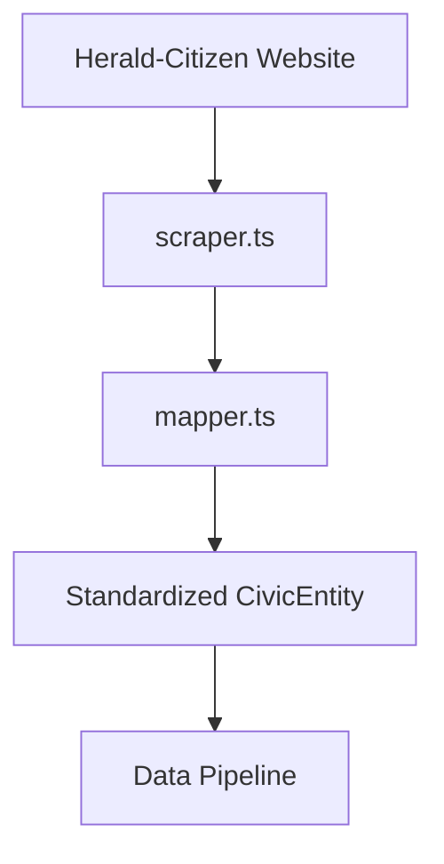

# Herald-Citizen News Source Connector

## Purpose
Ingests news articles from Herald-Citizen Media (Putnam County's local newspaper) to create a civic analysis data stream focused on community events, announcements, and public notices.

## Key Features
- **Scheduled Scraping**: Automated daily extraction during low-traffic windows
- **Content Validation**: Filters by minimum length and removes boilerplate
- **Metadata Extraction**: Captures author, publication date, and section tags
- **Error Resilience**: Retries network failures with exponential backoff
- **Data Standardization**: Uniform CivicEntity schema output

## Architecture


## File Structure
```
/lib/connectors/news-source/
├── config.json          # Source configuration & scraping rules
├── index.ts             # Connection points
├── mapper.ts            # Schema transformation
└── scraper.ts           # HTTP fetching & HTML parsing
```

## Configuration
```json
{
  "name": "news-source",
  "version": "1.0.0",
  "description": "Herald-Citizen Media Connector for Putnam County Civic Analysis",
  "baseUrl": "https://www.heraldcitizen.com",
  "politicsEndpoint": "/Politics",
  "electionEndpoint": "/Election",
  "governmentEndpoint": "/Government",
  "civicEndpoint": "/Civic",
  "scrapingSchedule": "daily",
  "maxArticles": 50,
  "dataCategories": [
    "political_news",
    "election_coverage",
    "government_meetings",
    "court_cases",
    "civic_events"
  ],
  "parsing": {
    "title": "h2.title",
    "link": "a",
    "content": ".article-content",
    "date": ".date",
    "source": ".source",
    "category": ".category"
  }
}
```

## Testing
Validate functionality:
```bash
# Tests would verify parsing rules and data extraction
# Example: npx ts-node --esm lib/connectors/news-source/test-scraper.ts
```

## Integration
Registered in `/lib/pipeline/data-pipeline.ts` for concurrent execution with other civic data sources.